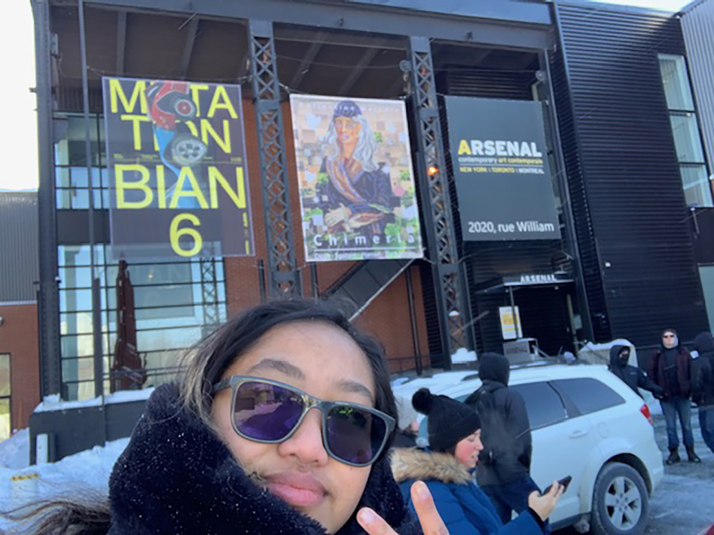
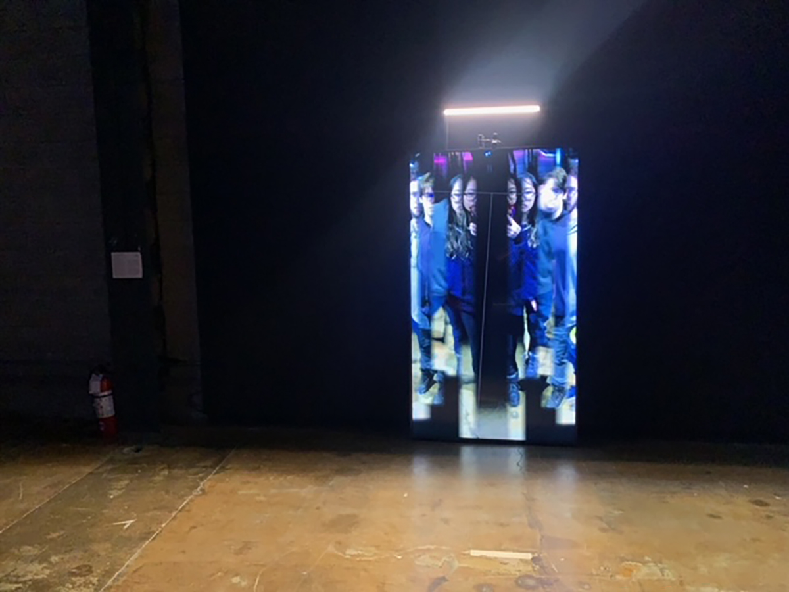
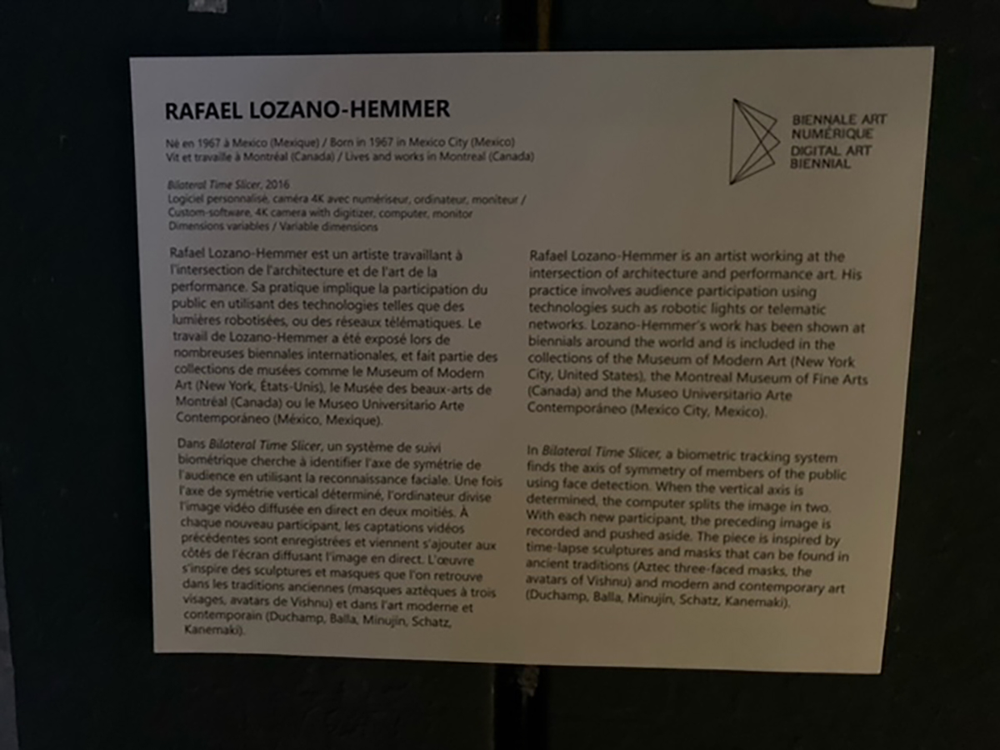
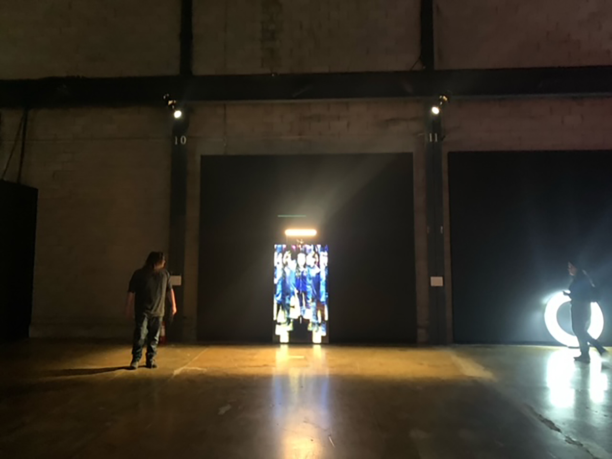
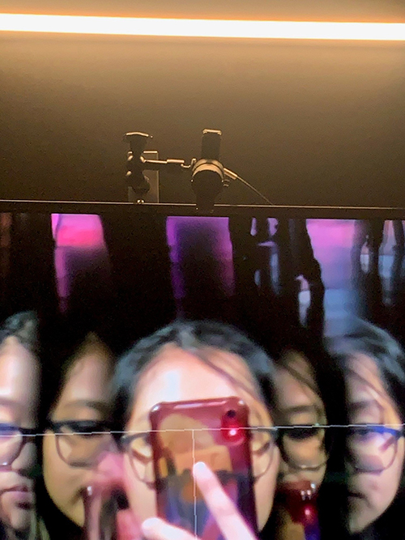
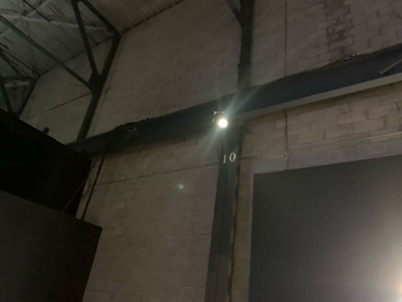
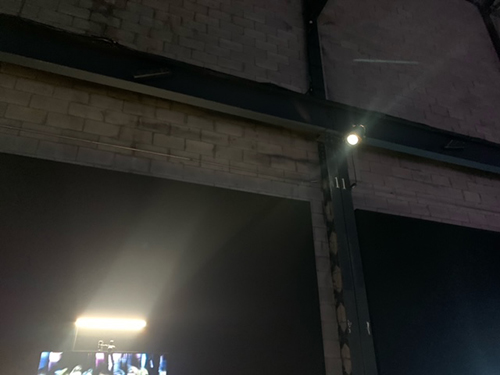
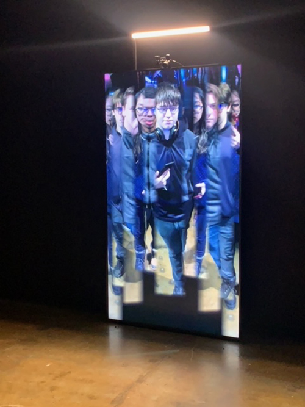

# LA VISITE ET L'EXPÉRIENCE DE LA 6E BIENNALE INTERNATIONALE D'ART NUMÉRIQUE (BIAN)

<h2>Nom de l'exposition</h2> 
Elektra à la 6e biennale internationale d'art numérique

<h2>Type de l'exposition</h2> 
Temporaire, Intérieure et Itinérante 

<h2>Date de la visite</h2>
Vendredi, le 3 Février 2023

<h2>Lieu de l'exposition</h2>
2020 rue William, Montréal: Arsenal contemporary art contemporain

<h2>Titre de l'oeuvre</h2>
Bilateral Time Slicer

<h2>Nom de l'artiste</h2>
Rafael Lozano-Hemmer

<h2>Année de réalisation</h2>
2016

<h2>Type d'installation</h2>
Intéractive

. 

<h2>Description de l'oeuvre</h2>
Pour suivre la thématique de la mutation, le Bilateral Time Slicer s'inspire énormément des masques anciens, plus spécifiquement le masque à trois visages dans la culture aztèque qui démontre le visage du millieu étant le plus jeune/récent et les visages de côtés étant les portraits plus anciens, tout en lui donnant aussi un aspect d'art moderne et contemporain grâce à la technologie d'aujourd'hui. C'est une oeuvre qui fusionne les générations modernes et anciennes non seulement dans son symbolisme, mais aussi dans sa présentation selon le site de Rafael Lozano-Hemmer.  

<h2>Mise en espace</h2>
Comme on peut l'observer, l'espace donné pour cette oeuvre en particulier est plutôt grande, n'ayant seulement une autre oeuvre à sa gauche et des oeuvres en avant qui se sépare assez bien. Pour créer un immersion, on peut apercevoir que les employés de l'exposition ont mis un faux mûr noir à la place de l'installer directement sur le mûr de leur bâtiment, aidant à l'atmosphère sombre et à la vision de l'oeuvre puisque c'est un écran qui projete un vidéo numérique. Ensuite, il y a plusieurs lumières d'une teinte orangée qui vient éclairer l'oeuvre, mais aussi le plancher qui aide à démontrer et bien allumer le ruban adhésif qui montre l'emplacement nécessaire pour intéragir. Les lumières aident aussi à séparer l'oeuvre du reste de l'exposition. Un élément qui peut être confusant est les deux cartels qui entoure le Bilateral Time Slicer, les deux étant autant proches de l'oeuvre alors c'est facile de ne pas savoir quel cartel appartient à quelle oeuvre, surtout quand elles ne sont pas illuminées. En plus, il est facile de voir l'extincteur de feu puisqu'il est placé un peu trop proche du cartel. Autre que cela, l'écran est placé au centre de sa partie du mûr pour laisser un bon espace et probablement pour l'esthétisme.  

<h2>Composantes et techniques</h2>
Les composantes visibles à l'audience est plutôt d'un nombre simple. Dans les composantes qui sont (probablement) fournies par l'artiste et sont équipe, il semble que la caméra, elle qui se retrouve par dessus l'écran nécessite une certaine fonction qu'il décrit en anglais en tant qu'un "digitizer". Non seulement équipé d'une lentille performante, mais aussi accroché avec des fils qui vont se cacher derrière l'écran qui va démontrer l'oeuvre qui est plus la composition de la caméra et le montage que son système fait avec les captures de personnes. Ensuite, il y a aussi une nécessité d'un ram (MAC) pour pouvoir faire marcher son programme accompagné d'un mini recorder, des captures HDMI, un fil thunderbolt, un mini cable HDMI, un support "swivel" pour la caméra, un fil LED et un clavier, tous caché derrière l'écran.  

Parlant de la technique, il est bien expliqué dans le site officiel de l'artiste que la manière que ça fonctionne est grâce à un programe fait par lui même qui prend des photos des gens en faisant du "tracking" de l'axe vertical des visages. 

<h2>Éléments nécessaires lors mise en exposition</h2>
Il y a évidemment l'écran qui est nécessaire puisqu'elle permet de projeter les vidéos prisent par la caméra qui se retrouve juste par dessus celui-ci. Pour bien dépeindre le corps complet de la personne qui intéragie avec l'oeuvre, l'écran qui est plutôt petit est placé verticalement, comme un mirroir. C'est un écran fourni par la facilité/exposition puisque dans son manuel, il n'est pas spécifié quel l'écran que l'oeuvre nécessite, seulement le minimum de performance. Il y a aussi des projecteurs bien placé pour mettre en évidence l'oeuvre, mais autre que pour mettre l'oeuvre dans un place visible, je ne penses pas que la qualité de la lumière est importante. C'est plus une nécessité pour le fonctionnement de l'oeuvre qui a besoin d'une personne placée sur le ruban adhésif. J'imagine aussi que le ruban provient de l'exposition puisqu'il étant le même que celui qui limitait les autres oeuvres.   
 

<h2>Expérience vécue</h2>
En gros, l'expérience vécue par le visiteur de l'exposition lorsque la personne rentre en contact avec l'oeuvre est supposé de se passer sous ces étapes: Apercevoir les écrans et les images des autres personnes qui ont intéragient auparavant, donnant la confirmation que c'est une oeuvre interactive. Apercevoir la ligne/ruban adhésif qui démontre une certaine explication qu'on doit s'installer dessus pour que l'oeuvre marche. S'installer sur le ruban adhésif. Réaliser que la caméra suit notre visage. Sortir de la ligne pour que la caméra ne suit plus. Voir notre portrait en mutation avec les autres sur l'écran. 
 
Tout est démontré dans le video mis dans la section (Type d'installation) 

<h2>Ce qui m'a plu</h2>
N'ayant pas souvent la chance de pouvoir expériencer des expositions, j'étais déjà heureuse de pouvoir y assister cette fois-ci. Il y a beaucoup d'éléments que j'ai appréciée durant mon temps à l'exposition comme toutes les différents arts numériques qui étaient interactifs. J'aime bien les activités qui nécessitent une certaine participation afin de rejoindre les gens. J'aime aussi la noiceur qu'il y avait dans la salle pour qu'on ayent une bonne vue des écrans, mais ce n'était pas trop noir non plus afin de pouvoir voir le ruban adhésif sur le plancher. En plus, c'était intéressant de voir le multimédia sous plusieurs projets uniques et si différents.

<h2>Aspects à changer (selon moi)</h2>
Selon moi, je trouve qu'il y a une possibilité de changer quelques éléments de l'oeuvre que j'ai choisis et de l'exposition en tant que tel. Pour commencer, la première chose que j'ai réalisé à propos du Bilateral Time Slicer autre que l'oeuvre elle même (puisqu'elle est numérique, elle illumine la pièce plutôt noire) est le bizarre emplacement de l'extincteur de feu. Peut-être que c'est un signe que l'oeuvre en tant que telle ou des oeuvres rapprochées ont l'habitude de se prendre en feu, mais c'est étrange, surtout quand la plupart des oeuvres dans cette pièce étaient des écrans. Malgré le manque de lumière, la couleur rouge flash de l'extincteur peut quand même se faire voir, surtout quand il est placé si près malgré le grand espace libre vers la gauche. Encore pire, il était placé juste en dessous du cartel, ce qui était néanmoins une distraction. Ensuite, celui-ci n'est pas nécessairement un problème, mais plutôt une préférence. Je trouve que l'écran, malgré le moyen de transport simplifié, devrait être plus long sur les côtés pour pouvoir mélanger plus de personnes et images ensemble.  

<h2>Source de référence</h2>
https://www.lozano-hemmer.com/bilateral_time_slicer.php

