# Pointe-à-Callière, Cité d'archéologie et d'histoire de Montréal, Montréal au coeur des échanges

<h2>Nom de l'exposition</h2>
Montréal au coeur des échanges

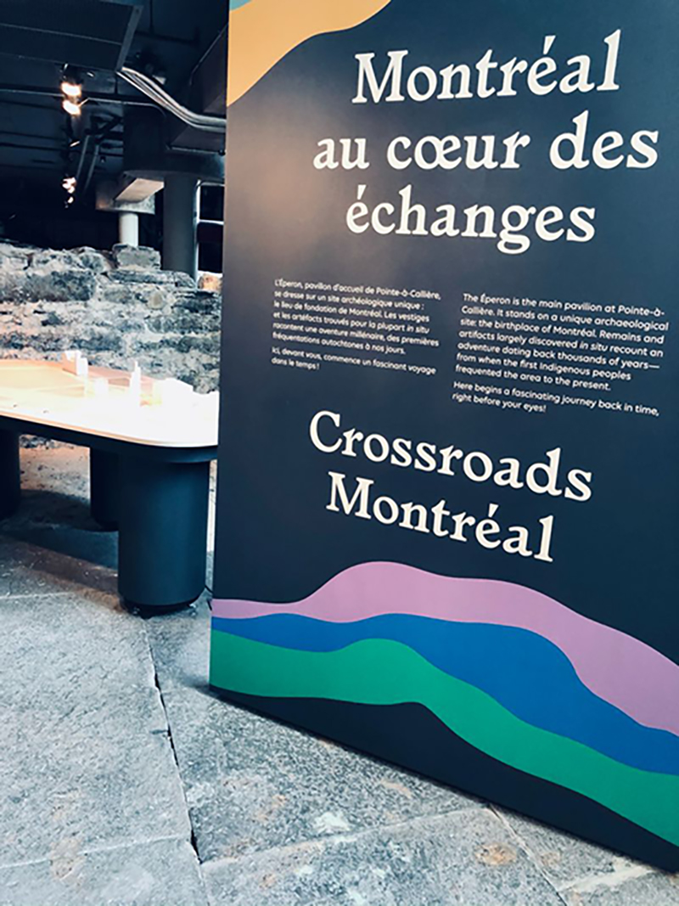

https://ca.linkedin.com/in/louise-delisle-675bb769

<h2>Type d'exposition</h2>
Permanente et intérieure

<h2>Date de la visite</h2>
Vendredi le 3 Mars 2023

<h2>Lieu de l'exposition</h2>
Pointe-à-Callière, Cité d'archéologie et d'histoire de Montréal

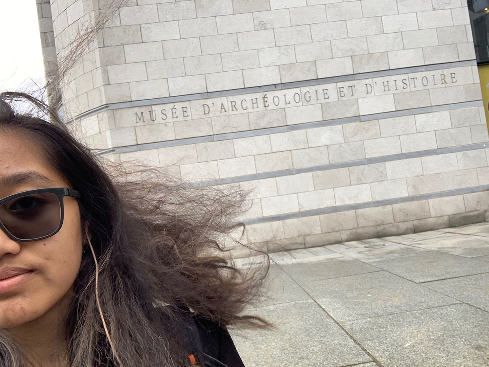

<h2>Titre de l'oeuvre</h2>
Une vie de nomade 

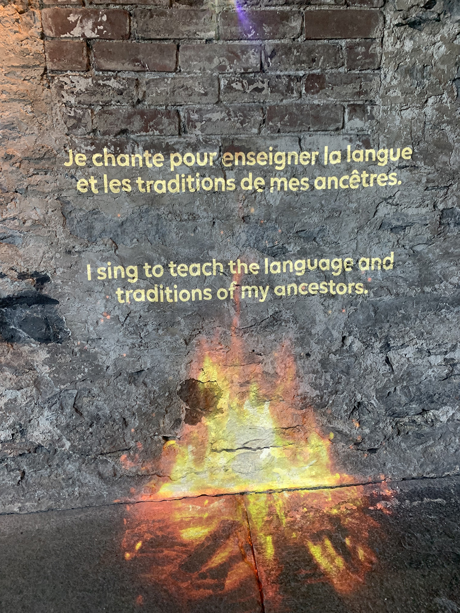

<h2>Nom de l'artiste</h2>
Dominique Rankin 

<h2>Année de réalisation</h2>
Pas mentionnée

<h2>Type d'installation</h2>
Oeuvre contemplative

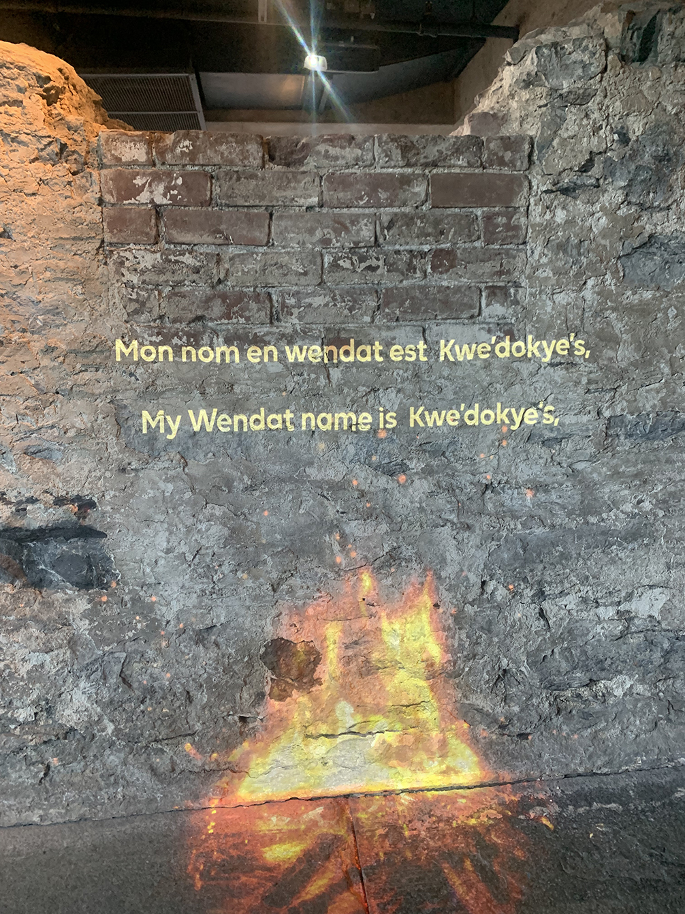

<h2>Fonction du dispositif multimédia</h2>
Diffusion du patrimoine immatériel

<h2>Description de l'oeuvre</h2>
La vie de nomade est une oeuvre qui compile des récits et des chansons traditionnelles en vidéo pour que les visiteurs de l'exposition peuvent apprendre un peu plus sur la culture et les traditions des peuples nomades, plus spécifiquement trois nations autochtones (les Mohawks, les Wendat et les Anicinape). Le projet est présenté sous forme vidéo pour garder la tradition de raconter les histoires oralement autour d'un feu de camp (C'est pour cela qu'il y a la vidéo d'un feu) pour garder l'ambiance.

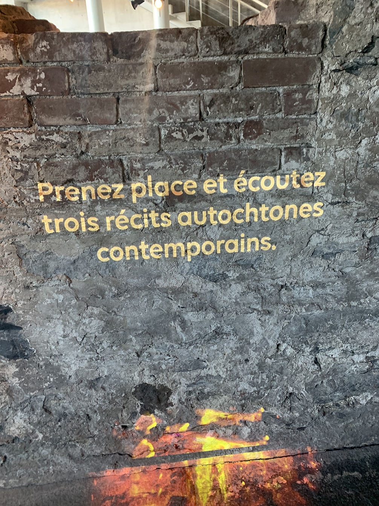

<h2>Mise en espace</h2>
Le projet se retrouve sur un mur de brique, une ruine archéologique de Ville-Marie qui se retrouve dans le niveau souterrain du bâtiment de Pointe-à-Callière, Cité d'archéologie et d'histoire de Montréal. Près de l'entrée, le projet se retrouve dans un coin plutôt petit, mais puisque c'est un espace ouvert, ce n'est pas un endroit claustrophobique. Autour de l'oeuvre, il y a plusieurs autres ruines et plusieurs autres oeuvres à propos des communautés autochtones. Derrière se retrouve les escaliers de sortie et près de la vidéo se retrouve le panneau vert de sortie qui ne gâche pas nécessairement l'oeuvre puisqu'elle est beaucoup plus haute. 

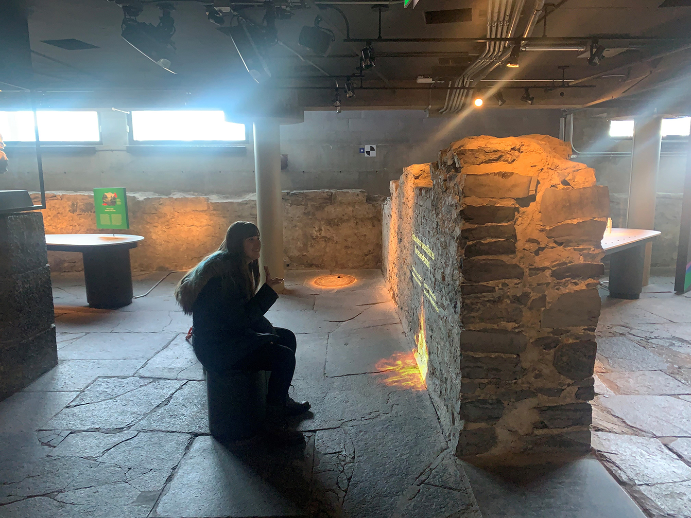 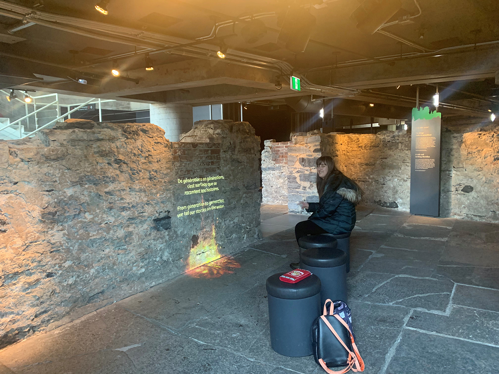 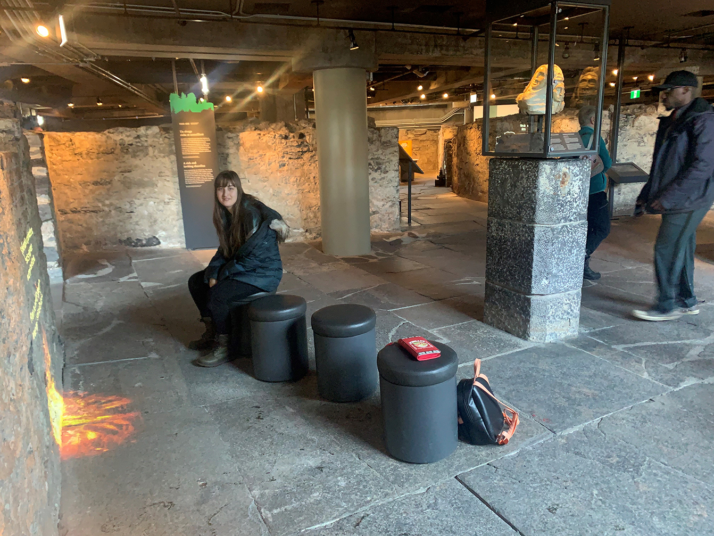 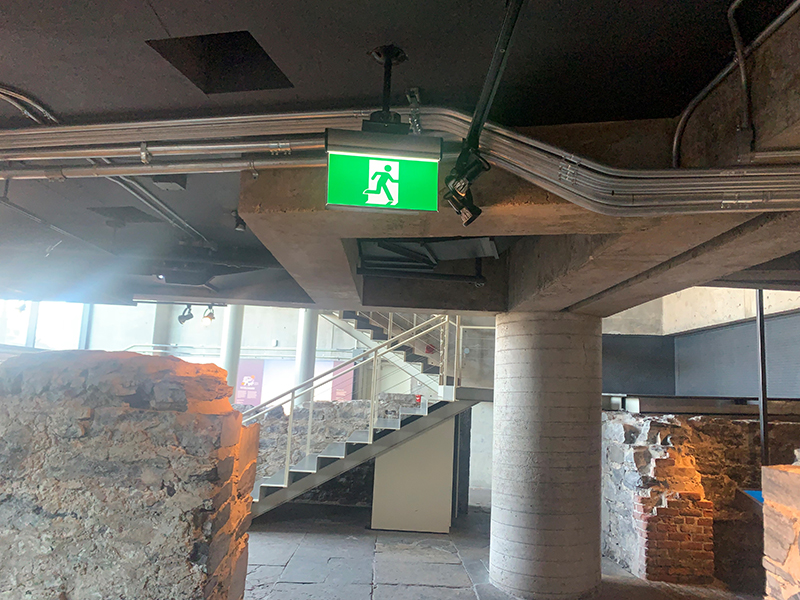

<h2>Composantes et techniques</h2>
C'est un dispositif multimédia qui est plutôt simple. La vidéo est faite sur un logiciel inconnu par le visiteur et celui-ci est projeté sur la ruine grâce à un projecteur installé sur le plafond plutôt bas. Non seulement il y a le projecteur, mais sur le plafond, il y a aussi deux lumières et un haut-parleur installés pour l'ambiance et notre écoute. Après tout, l'oeuvre est plus sonore qu'autre chose. 

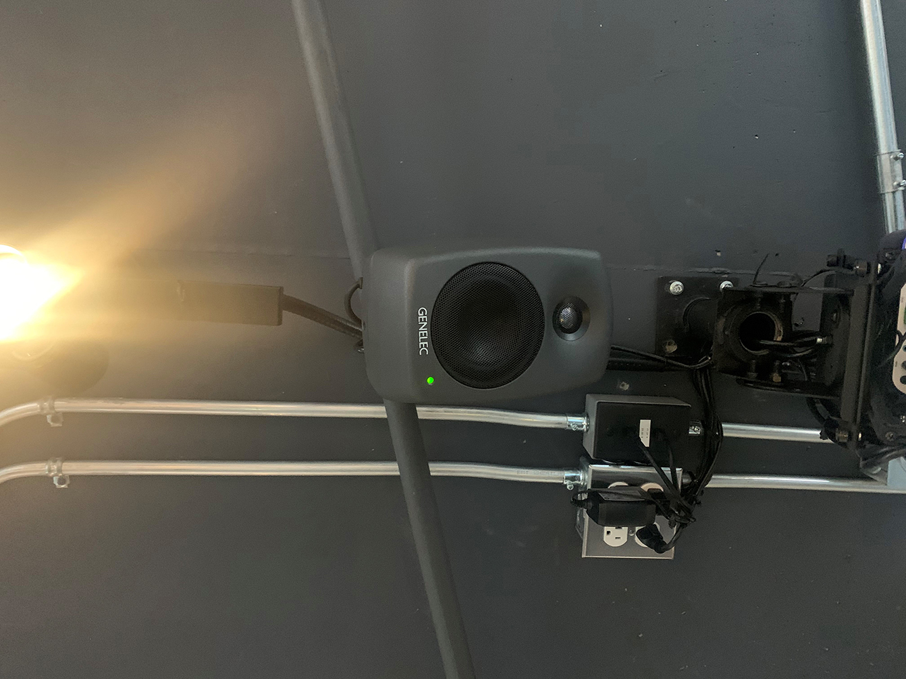 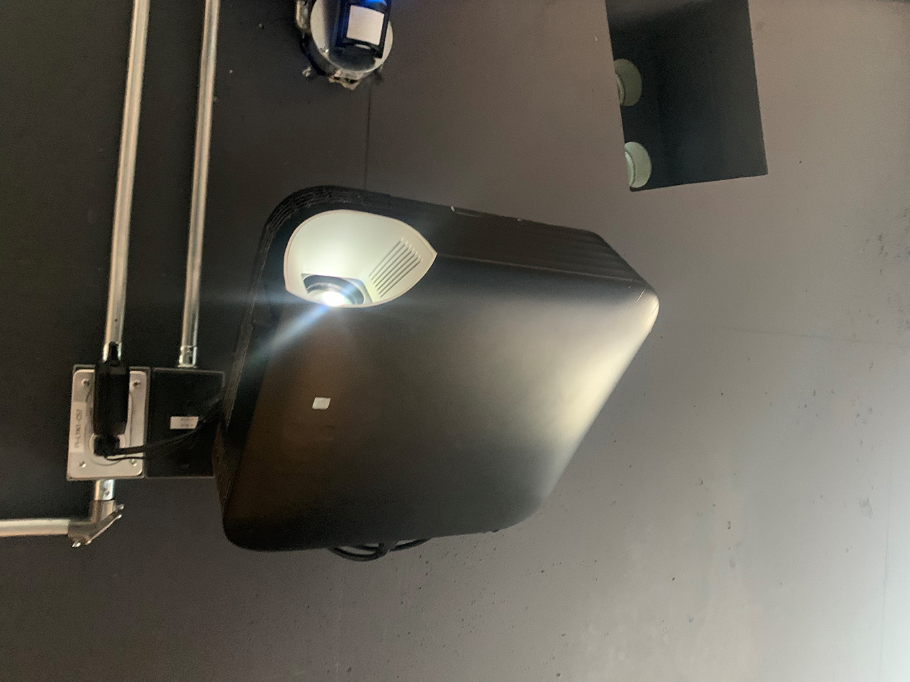 

<h2>Éléments nécessaires pour la mise en exposition</h2>
Je pense que c'est une nécessité d'avoir le dispositif médiatique affiché sur une ruine du village pour garder le projet authentique à la culture et la période de temps. Puisqu'il y en a partout, le musée n'a pas le choix de la présenter dessus. Malgré tout, il y a une possibilité que la vidéo puisse aussi être présentée sur un écran à la place de se faire projeter, mais la projection rend l'oeuvre un peu plus réelle et fusionne mieux avec son entourage en projection. De plus, il y a une partie de la projection qui se retrouve sur le plancher, ce qui serait impossible à faire sur un écran. La composante la plus importante dans l'oeuvre est le haut-parleur puisque c'est cette composante qui permet aux visiteurs de contempler l'oeuvre. En plus, les lumières accrochées au plafond proviennent aussi du lieu de l'exposition afin de bien éclairer l'environnement. Finalement, il y a des petites chaises à une taille parfaite pour qu'on puisse visionner l'oeuvre sans être inconfortable et ceci est sûrement donné par le musée.  

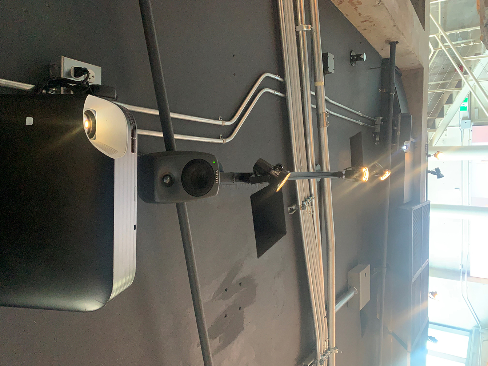

<h2>Expérience vécue</h2>
En gros, le visiteur s'approche de la projection après d'avoir visité plusieurs ou peut-être une oeuvre en lien avec la culture autochtone. Peut-être que l'existence des chaises amène la curiosité du visiteur puisqu'il n'y en a pas autour. Comme on le fait avec un film, le visiteur va s'asseoir sur une des chaises et regarder la vidéo projetée. Puisque c'est une vidéo qui joue en répétition, il est très possible que le visiteur arrive et écoute la vidéo quelques minutes en retard. La vidéo montre les sous-titres du audio afin de faciliter la compréhension de l'audio puisque le projet se retrouve dans un espace ouvert avec beaucoup d'écho. Lorsque la vidéo est finie, le visiteur peut continuer sa visite ou même de recommencer à regarder la vidéo. 

<h2>Ce qui m'a plu</h2>
Il y a beaucoup de choses qui m'ont plu durant ma visite de l'exposition, mais cette pièce médiatique m'a attrapé l'oeil très facilement. La première raison étant les chaises puisqu'il n'y en a pas dans cette section de l'exposition alors on pouvait prendre notre temps pour nous relaxer sur ses chaises. Ensuite, il y avait aussi la partie audio qui m'a charmée. Encore une fois, c'est une partie plutôt unique dans l'exposition, n'ayant que cette oeuvre qui nécessite de l'audio dans la salle. Honnêtement, je ne connais pas plus sur les Autochtones que ce que j'ai appris à l'école alors cette exposition m'a ouvert un peu plus les yeux sur leurs cultures. Une chose que j'ai beaucoup aimée était le fait que la vidéo et l'audio est une représentation d'une tradition immatérielle comparée à tout ce qu'il y avait dans le bâtiment. Cela rend ce projet beaucoup plus unique.  

<h2>Aspects à changer selon moi</h2>
Je trouve que l'oeuvre est honnêtement plutôt parfaite. Je n'ai pas vraiment d'aspects que je veux changer à propos de "La vie de nomade" autre que son emplacement. C'est bizarre qu'il soit presque au milieu du couloir lorsqu'on aurait pu le bouger un peu plus vers la gauche sans vraiment avoir de problème. 
