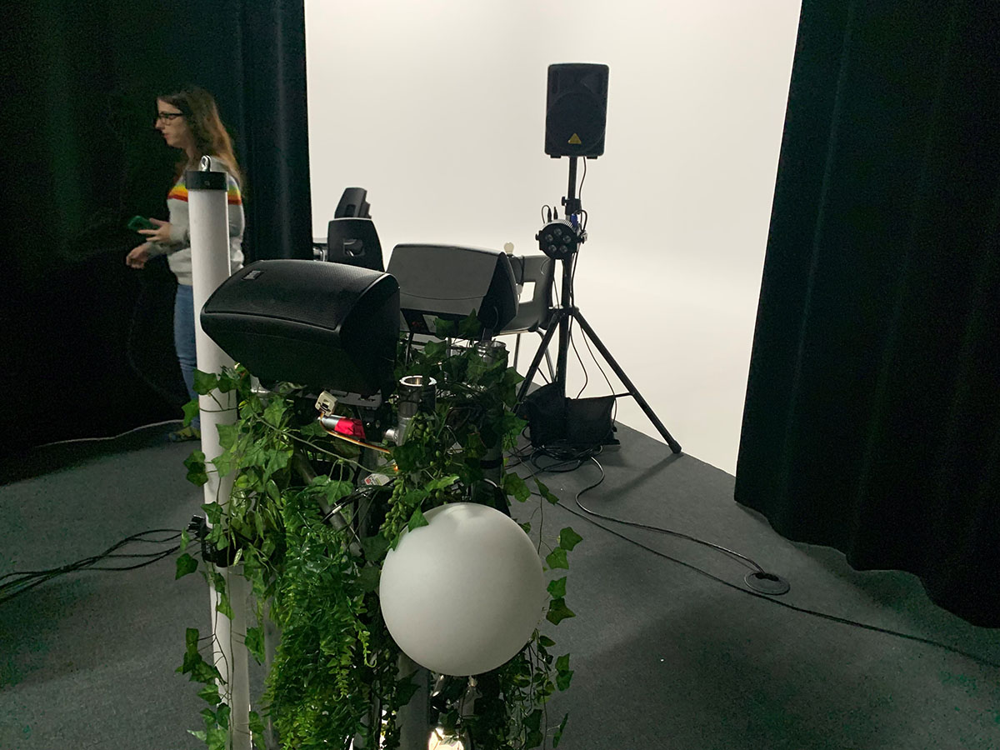
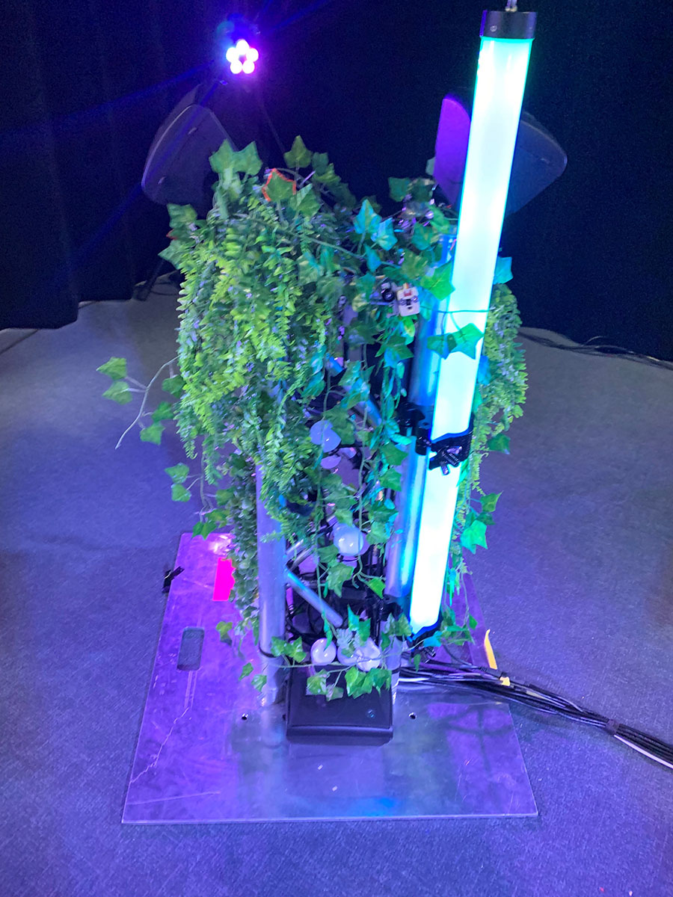
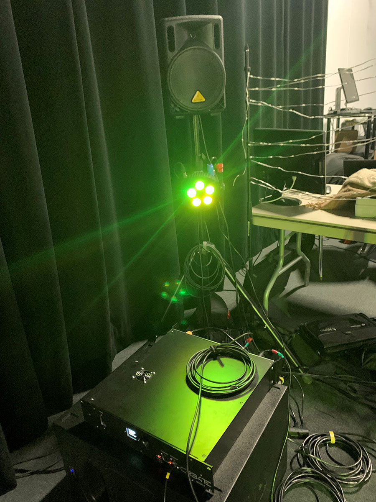
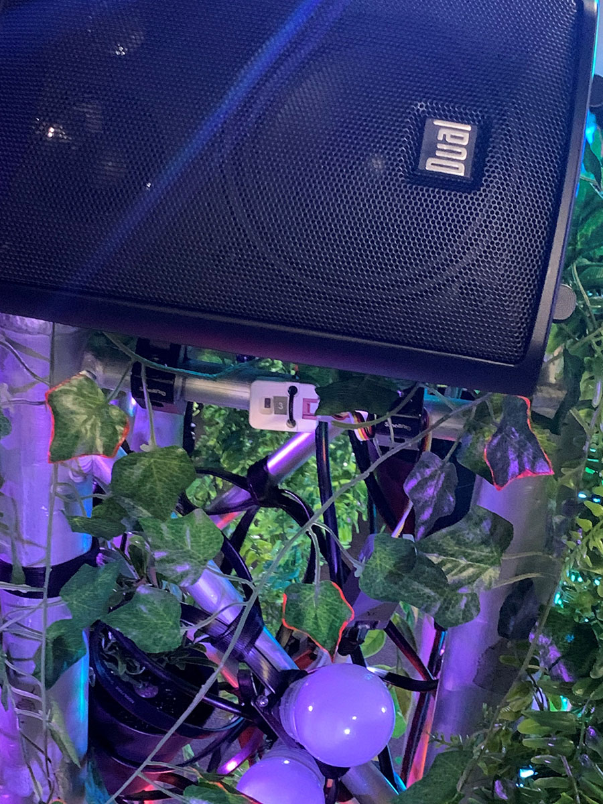
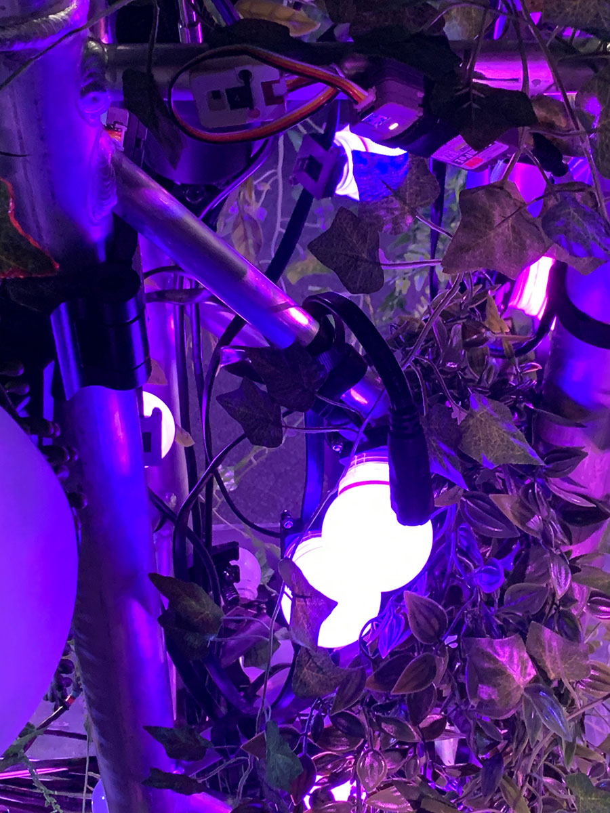
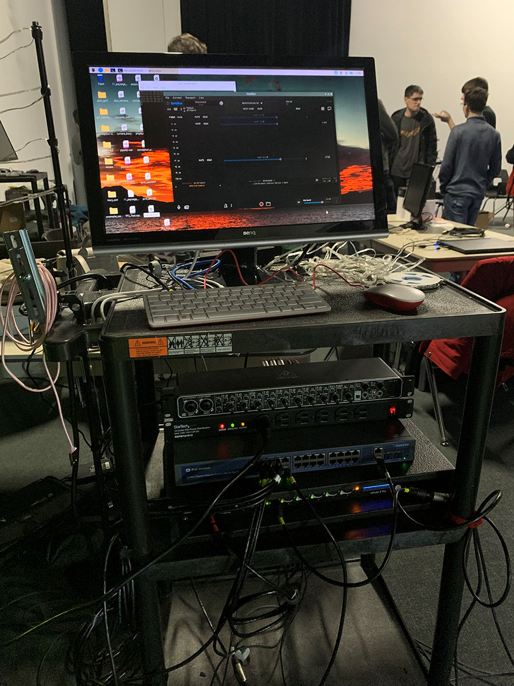
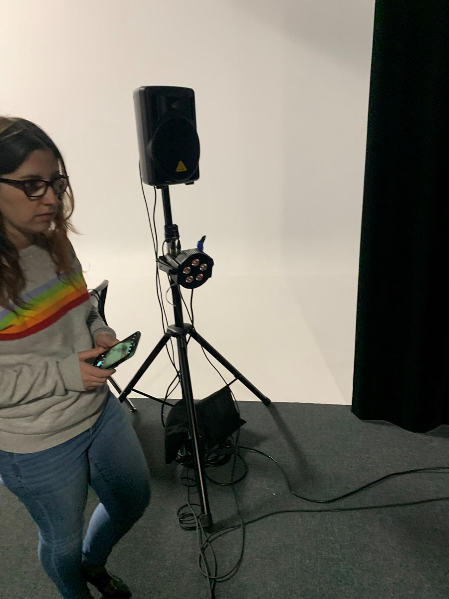
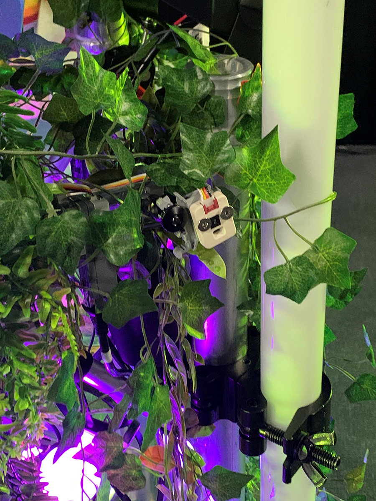

Projet réalisé par **Elwin Durand, Loic Delorme, Dominic Roberts, Gabriel Leblanc, Meryem Berbiche et Jean-Christophe**

<h2>Synopsis du projet</h2> 
Edria donne la possibilité aux visiteurs d'explorer un univers féerique grâce au déclenchement d'un spectacle de lumière et sons lorsqu'ils sont activés. Dépendamment  de ta position, on peut visiter quelque chose de nouveau et même créer de la musique avec tes voisins. Ce projet vise à donner une expérience confortante et magnifique pour les yeux et les oreilles de leurs visiteurs durant les journées froides de l'hiver et de nous rappeler de la beauté de la nature grâce à l'interaction avec les gens autour de nous. 

<h2>Lien avec le thème</h2> 
Pour rendre cela simple, le thème mycélium (qui est le nom d'un champignon) se retrouve non seulement dans leur aspect d'environnement féerique, mais aussi dans la nécessité de tisser des liens avec d'autres gens afin d'essayer le projet à son meilleur. À cause des différents capteurs de mouvements qui déclenchent des motifs de de la lumière et de la musique différente, le projet a besoin de l'interaction de plus d'une personne. En plus, c'est un autre projet fondé sur la nature. C'est rendu évident avec l'ambiance donné par les plantes décoratives.  

<h2>L'installation en cours</h2> 
Pour le moment présent, l'équipe se retrouve avec beaucoup d'équipements qui ne seront pas dans l'installation finale. De ce qu'on a pu observer, l'installation comporte cinq piliers pour le monument. Un au centre qui est décoré de quatre capteurs de mouvement sur ses quatre côtés, chacun activant des motifs différents. Lorsqu'ils sont activés tous ensemble, ils déclenchent un motif de musique et de lumière spécial. Pour le moment, ils ont aussi 4 autres piliers qui supportent des lumières et des haut-parleurs. Ceux-ci ne font pas partie des animations spéciales pour le moment, mais ça garde  une bonne ambiance de toute l'espace, non seulement au milieu. Autre que ses composantes, il n'y a que les ordinateurs qui contrôllent le tout qui se retrouvait à côté du projet pour le moment.

<h2>L'installation prévue</h2> 
Pour l'installation finale, les colonnes qu'ils ont commandées vont être à peu près trois fois la taille de ceux qu'ils ont pour le moment. De plus, il y en aurait pas juste quatre, mais plutôt huit en tout pour prendre le plus de surface possible et garder l'ambiance. Pour les capteurs de mouvement, ils vont pouvoir changer ceux qu'ils ont pour des capteurs plus performants et qui captent une plus grande distance. Pour le côté plus naturel de leur projet, ils vont aussi ajouter sur leurs colonnes des plantes synthétiques qui ont aussi pour but de cacher en partie la technologie derrière. Leur projet est déjà bien préparé autre que cela. 

<h2>Expérience vécue</h2>
Le visiteur entre dans l'espace à partir d'une des multiples entrées possibles et s'approche du centre qui est supposé de capturer la curiosité de la personne. Lorsque la personne s'approche, un des détecteurs va s'activer et ensuite déclencher le motif de lumière et de musique qui lui appartient. Si jamais il y a un groupe de visiteurs qui activent les quatres capteurs en même temps, l'animation spéciale d'une minute va jouer sur tous les poteaux pour qu'ils puissent l'apprécier. Après leurs durées, le visiteur ou le groupe peuvent partir ou essayer des combinaisons différentes. 
