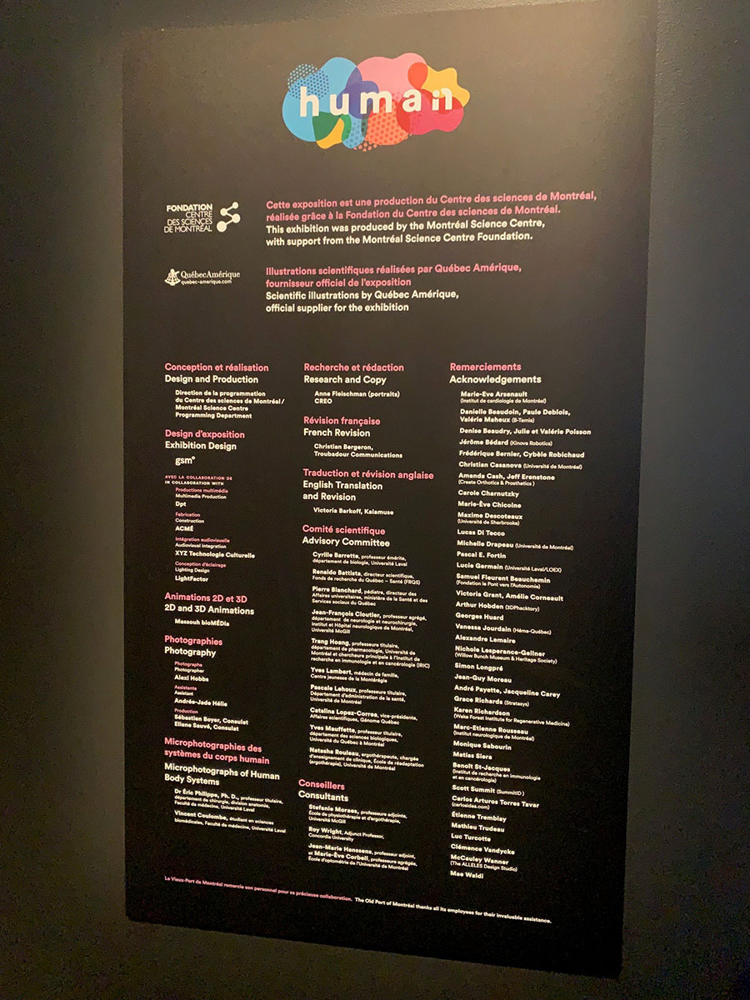
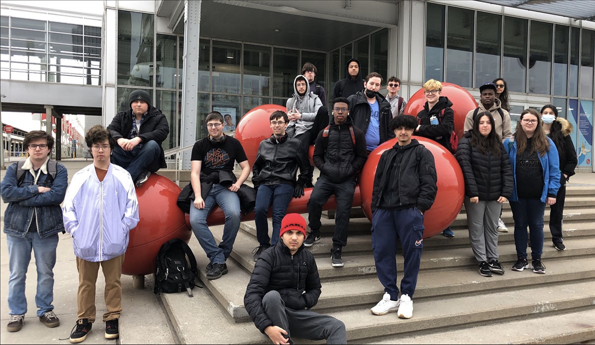
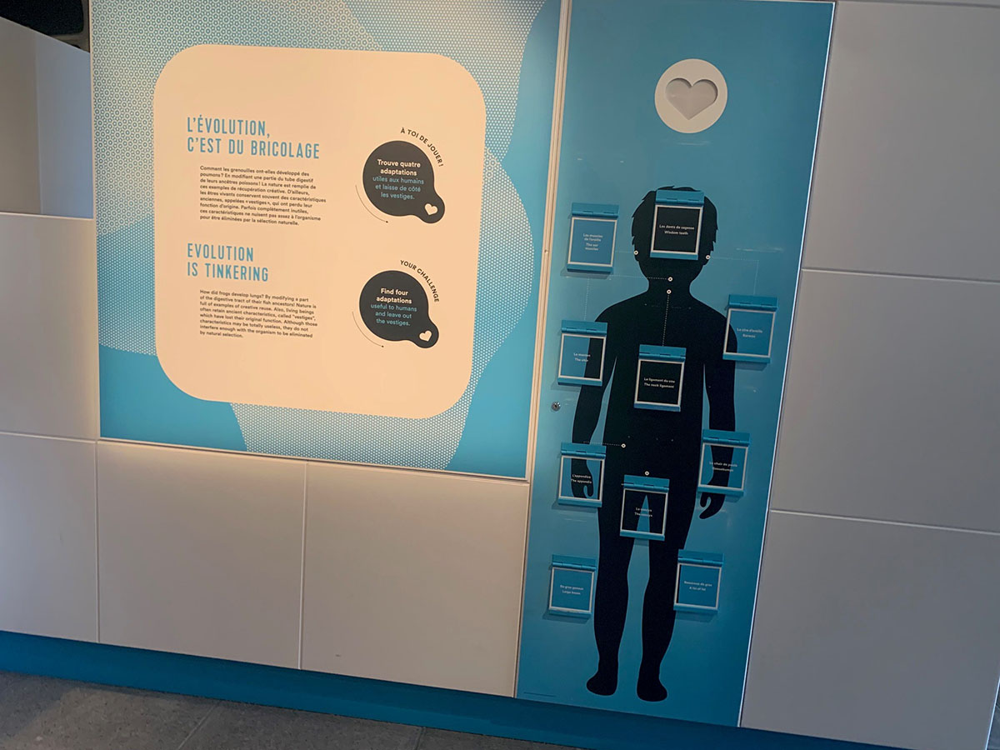
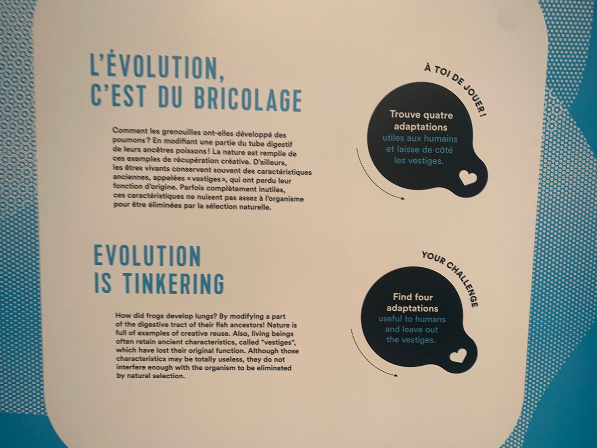
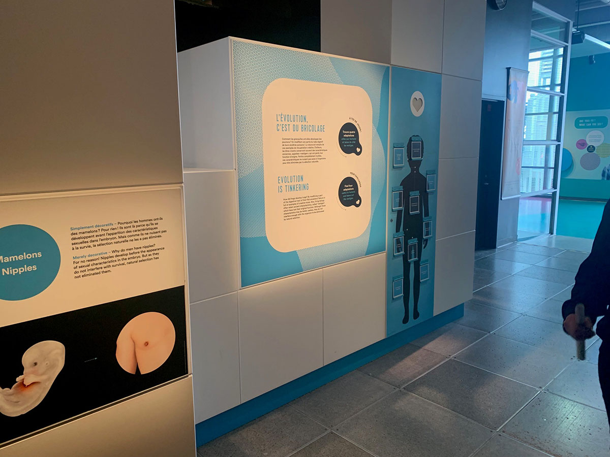
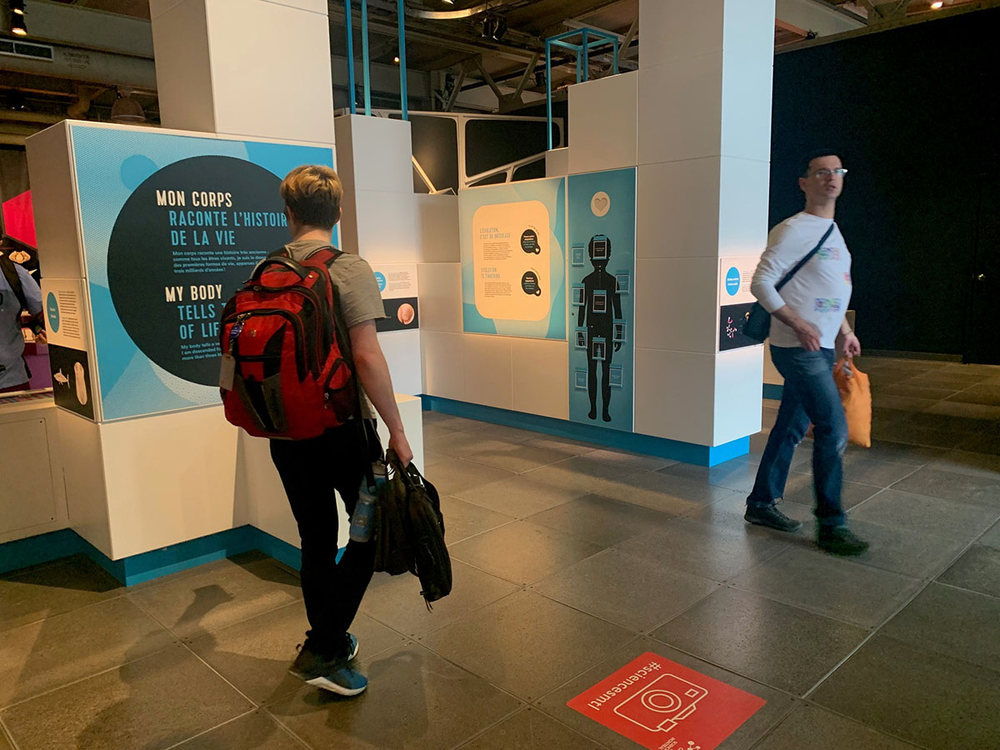
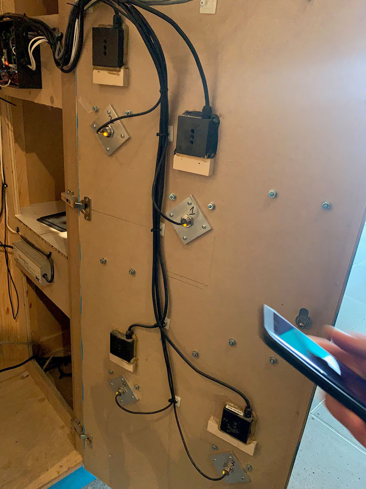
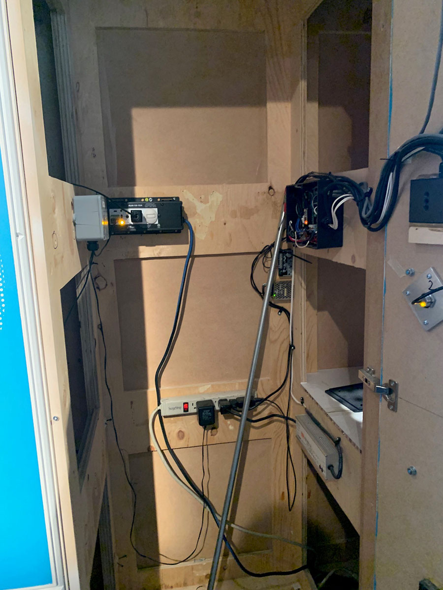
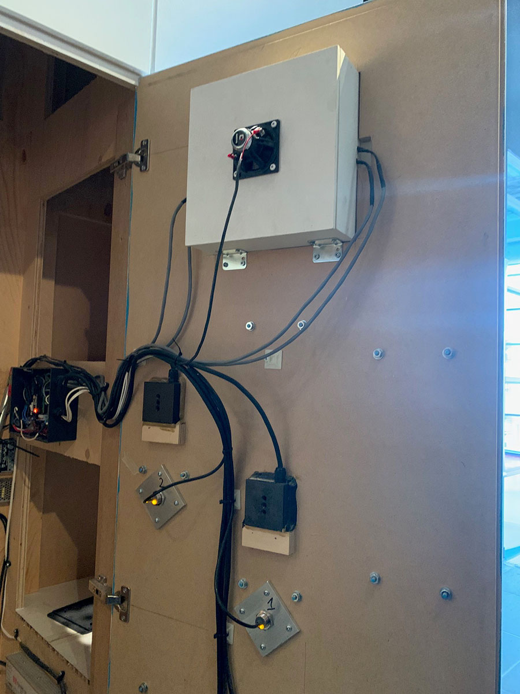
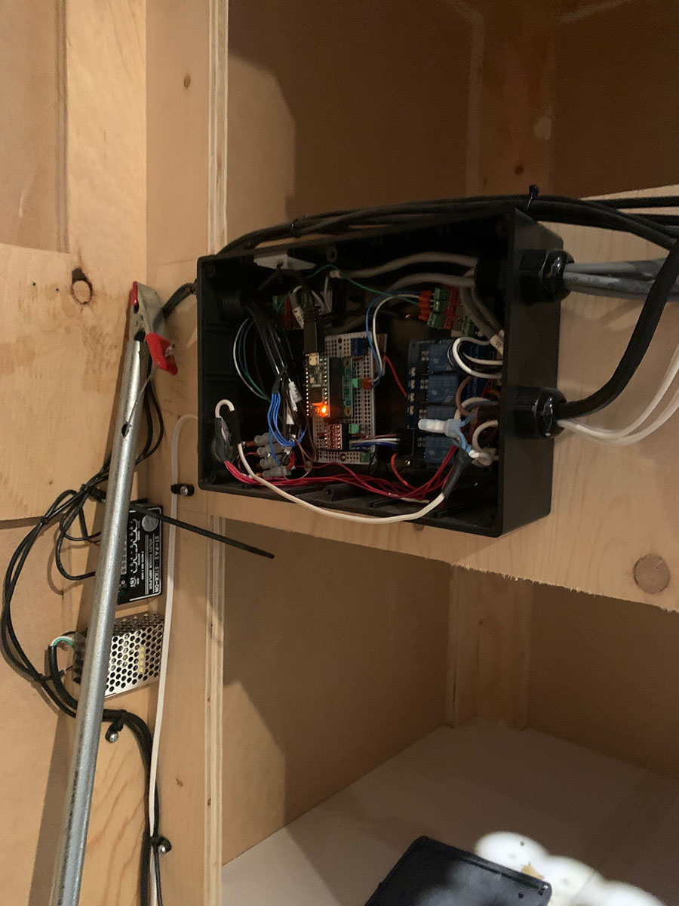

# La visite de groupe au Centre des sciences

<h2>Nom de l'exposition</h2>
Humain

<h2>Type d'exposition</h2>
Intérieure, Permanente

<h2>Date de la visite</h2>
Mercredi le 12 Avril 2023

<h2>Lieu de l'exposition</h2>
Le Centre des Sciences

<h2>Titre de l'oeuvre</h2>
Pas mentionné

<h2>Nom de l'auteur</h2>
Pas mentionné

<h2>Année de réalisation</h2>
Pas mentionné

<h2>Type d'installation</h2>
Dispositif multimédia d'apprentissage

<h2>Description de l'oeuvre</h2>
En gros, le dispositif interactif est une illustration d'un corps humain avec des portes ouvrantes sur certaines parties du corps. Cela crée une interaction qui laisse les visiteurs ouvrir les petites portes afin de vérifier si une d'entre elles correspond à une des caractéristiques anciennes que l'évolution n'a pas éliminées. En réussissant la tâche, le coeur par-dessus la silhouette devient rouge et célèbre ta réussite. C'est un projet qui a pour but de faire apprendre les visiteurs un peu plus sur le corps humain et ses caractéristiques considérées inutiles. 

<h2>Mise en espace</h2>
Tristement, le projet n'a pas énormément d'espace puisqu'il se retrouve entre deux projets et a l'espace d'un petit couloir. Il n'y avait presque pas de place pour notre groupe afin de visionner le dispositif. De plus, le projet n'est pas large ni grand, alors l'illustration prend une taille minime afin de ne pas enfarger dans les autres projets. Il n'y a pas de cartel, mais au côté gauche du projet, il y a une description stylisée en français et en anglais qui explique le but du projet interactif qui prend plus de place que le projet lui-même.  

<h2>Composantes et techniques</h2>
Lors de notre visite, le guide nous a ouvert la porte pour qu'on puisse voir l'installation mécanique derrière le projet puisqu'il n'y a aucunee des composantes techniques qui se retrouve à l'extérieur. Au derrière de la porte, on retrouve deux capteurs chacun qui sont installés au niveau des quatre bonnes réponses. Pour activer le coeur, les capteurs sont liés avec des fils qui passent dans un dispositif à l'intérieur de l'espace vide dans le mur derrière la porte. Ensuite, d'autres fils les connectent avec le coeur afin de l'allumer. De plus, à l'intérieur, il a des prises de courant et d'autres fils un peu partout afin de tout connecter.  

<h2>Éléments nécessaires pour la mise en exposition</h2>
L'installation de bois qui contient le projet et qui sert de mur pour les autres projets fait sûrement partie de l'exposition complète. Pour construire celui-ci nécessite sûrement plusieurs matériels comme des vis, un drill, des planches de bois, etc.,. De plus, l'extension pour les multiples prises provient sûrement de l'exposition afin de bien installer les fils. Il y a aussi une nécessité de donner assez d'espace pour le projet pour pouvoir interagir avec. En plus, il y a des choses qui attachent les fils ensemble afin de garder le projet propre.

<h2>Fonction du dispositif multimédia</h2>
Apprentissage

<h2>Expérience vécue</h2>
Le visiteur entre dans l'exposition Humain et aperçoit le projet juste en avant de lui. S'il est intéressé, il va s'approcher de celui-ci et lire la description après de donner un coup d'oeil au projet. Après d'avoir compris le but du projet, le visiteur va essayer de soulever une des portes à sa disposition. Lorsqu'un visiteur trouve un des quatre organes, une des quatre parties du coeur par-dessus de la silhouette humaine passe du blanc à rouge, ayant trois autres portes à ouvrir. S'il ne réussit pas, le coeur simplement reste à sa condition neutre. Il y a quatre bonnes réponses sur dix choix possibles. Lorsque les trois autres portes sont aussi ouvertes (grâce à un aimant), le coeur est complètement rouge et joue une petite fanfare pour célébrer. Ensuite, le visiteur ferme les portes afin de donner une chance aux prochains visiteurs.

<h2>Ce qui m'a plu</h2>
C'est un projet qui paraît plutôt simple au premier coup d'oeil, mais après inspection, c'est plutôt complexe et bien pensé. J'ai trouvé ce dispositif plus intéressant dans tous les projets que le guide nous a démontré. Aussi j'aime bien la propreté derrière le projet, car malgré la forme inconvéninente, tout est propre et bien attaché ensemble.  

<h2>Aspects à changer selon moi</h2>
Honnêtement, je n'ai aucune idée de quoi changer dans ce projet qui réussit déjà à sa tâche. C'est peut-être un peu plus complexe que nécessaire (le coeur), mais c'est apprécié. Peut-être donner ce projet un peu plus d'espace afin de ne pas être dans le chemin des gens qui passent dans le petit couloir. 
